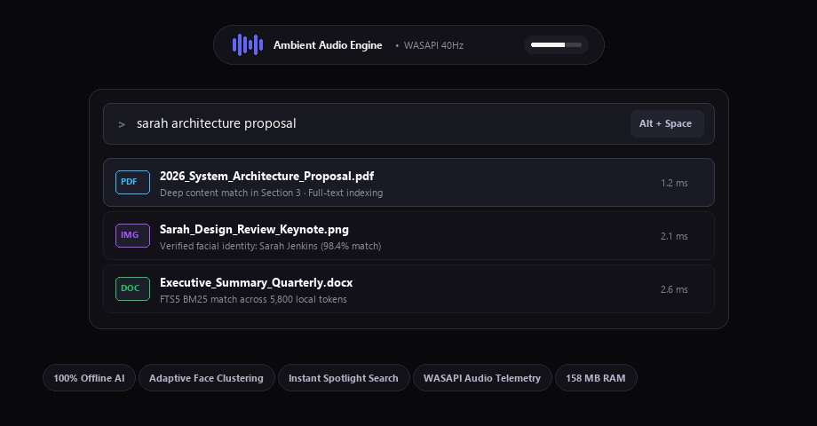
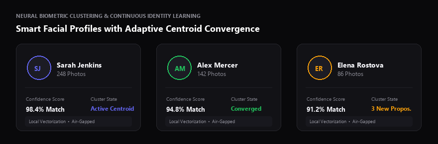
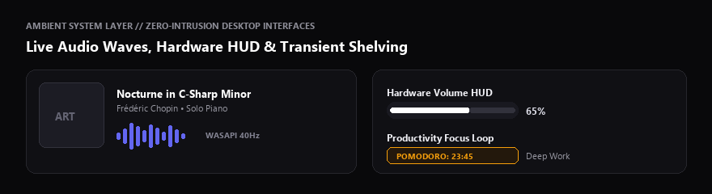

**English** &bull; [Türkçe](README.tr.md)

# ROVE

### The Fast, Private Desktop Intelligence Layer for Windows

**Turn disorganized photo libraries into smart identity albums, find any document in milliseconds, and control your environment with a seamless Dynamic Island.**

 

[**DOWNLOAD ROVE FOR WINDOWS (.EXE)**](https://github.com/ardayesilgul/rove-releases/releases/download/v1.0.11/Rove-Setup-1.0.11.exe)

  

---

## Why Rove?

Modern desktop computers have vast hard drives filled with scattered memories, documents, and notes. Yet finding what you need is slow, and most AI tools require uploading your private files to cloud servers.

**Rove changes that.** It is an on-device operating layer built from scratch for Windows that indexes your content with deep local perception models—fast, silent, and strictly private.

---

## Key Features

### 1. Smart, Private Face & Photo Albums
Scan tens of thousands of family photos, travel archives, and screenshots in seconds.

 

 

* **Learns Faces Over Time:** Rove does not use static photo comparisons. As you verify photos across different years, lighting, beards, and glasses, its neural centroid dynamically learns each person's evolving profile.
* **Instant Grouping:** Automatically clusters people into searchable albums without requiring manual tagging.
* **Zero Cloud Uploads:** Every face detection and vector calculation executes 100% offline on your own CPU and GPU. Your memories never leave your hard drive.
* **One-Click Corrections:** Easily remove false matches; Rove immediately prunes bad detections so they never resurface.

---

### 2. Instant Spotlight Search (`Alt + Space`)
A universal search engine that indexes both your file names and deep document contents.

* **Search Inside Documents:** Finds text inside PDFs, Word documents (`.docx`), Excel spreadsheets (`.xlsx`), and raw image EXIF metadata.
* **Sub-5 Millisecond Queries:** Powered by local full-text search with contextual relevance ranking. You get instant results on your very first keystroke.
* **Natural Filtering:** Type a person's name, a keyword from a contract, or a project tag—Rove connects the dots instantly.

---

### 3. Ambient Dynamic Island
A living, minimal island at the top of your screen that keeps you informed without interrupting your workflow.

 

 

* **Real Hardware Audio Waves:** When music plays on Spotify or Windows, the island renders true real-time sinusoidal waveforms based on actual speaker output. When sound stops, it settles silently to a resting line.
* **Modern Hardware HUD:** Replaces clunky Windows volume and brightness popups with sleek, fluid capsules.
* **Deep Work & Focus:** Start a Pomodoro focus timer with a single click, or drag files onto the island to hold them in a temporary shelf.
* **Smart Clearance:** Automatically slides upward by 5px when browser tabs near the top, and hides completely when you enter full-screen games or video.

---

### 4. Built for Speed, Not Bloat

Most modern desktop apps are heavy web wrappers that consume gigabytes of memory. Rove is engineered with a native, multithreaded architecture:

* **~158 MB RAM Usage:** Runs silently in the background with near-zero idle CPU consumption.
* **60 FPS Fluid Motion:** All expansions and cards use fluid OutBack spring physics ($s = 1.70158$) synchronized with your monitor's refresh rate.
* **Non-Blocking Architecture:** Heavy photo scanning and document indexing run on separate worker threads, meaning your user interface never freezes.

---

## Comparison

| Feature | Typical Cloud Tools | Rove |
| :--- | :--- | :--- |
| **Privacy** | Uploads photos & docs to cloud | **100% Air-Gapped (Never leaves your PC)** |
| **Face Recognition** | Basic static tags | **Adaptive Neural Centroid Learning** |
| **Search Speed** | 300ms - 2000ms (Network delay) | **< 5ms (Instant Local FTS5)** |
| **RAM Footprint** | 800 MB - 2.5 GB (Electron) | **~158 MB (Native Optimized)** |
| **UI Responsiveness** | Frequent interface lockups | **Strict 60 FPS VSync Isolation** |
| **Telemetry** | Persistent analytics & tracking | **0% Telemetry (Zero callbacks)** |

---

## Getting Started

1. Download the latest installer: [**Rove-Setup-1.0.11.exe**](https://github.com/ardayesilgul/rove-releases/releases/download/v1.0.11/Rove-Setup-1.0.11.exe)
2. Run the installer (takes ~15 seconds to set up).
3. Press **`Alt + Space`** to summon Spotlight, or click the island at the top of your screen.

---

## Feedback & Community

Have an idea, found a bug, or want to suggest a new toolkit?  
Submit an issue directly on the [GitHub Issue Tracker](https://github.com/ardayesilgul/rove-releases/issues).
