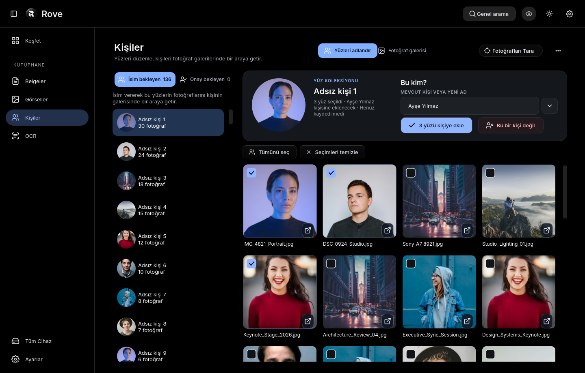
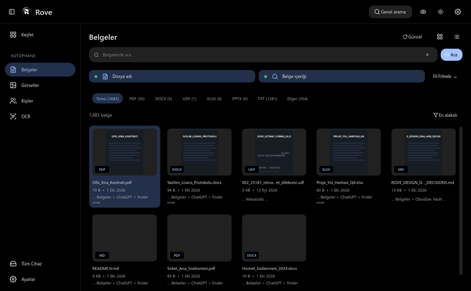
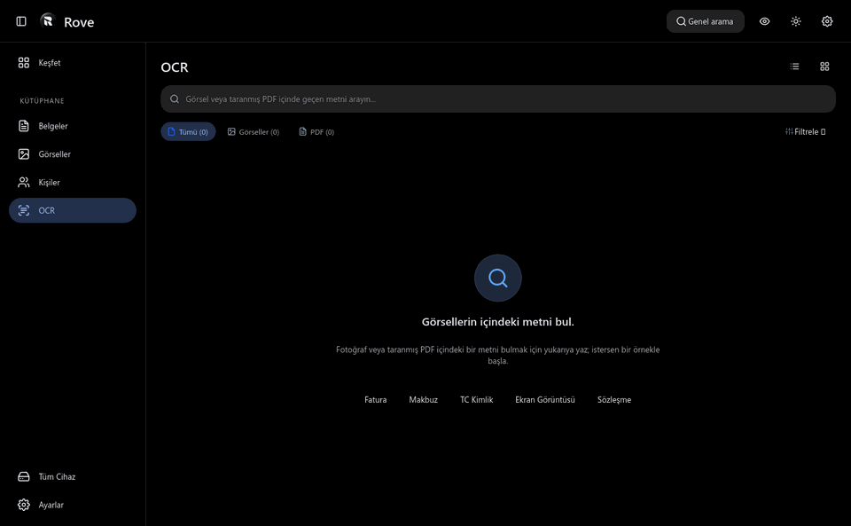
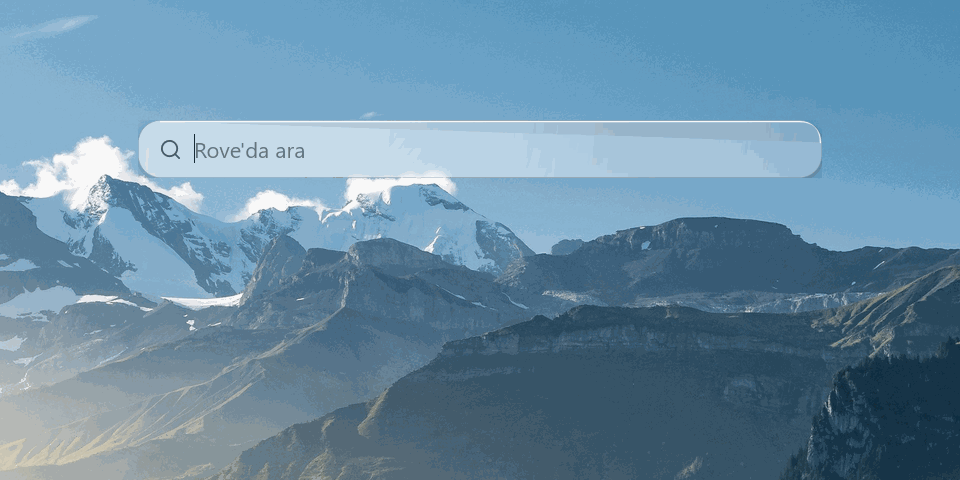

[English](README.md) &bull; **Türkçe**

# ROVE

### Windows İçin Hızlı, Gizli ve Akıllı Masaüstü Katmanı

**Dağınık fotoğraf arşivlerinizi akıllı albümlere dönüştürün, aradığınız her belgeyi milisaniyeler içinde bulun ve bilgisayarınızı Dinamik Ada ile yönetin.**

 

[**WINDOWS İÇİN ROVE'U İNDİR (.EXE)**](https://github.com/ardayesilgul/rove-releases/releases/download/v1.0.13/Rove-Setup-1.0.13.exe)

  

---

## Neden Rove?

Bilgisayarlarımızda yıllardır biriken binlerce dağınık fotoğraf, sözleşme, PDF ve not var. Ancak aradığımız bir anıyı veya önemli bir faturayı bulmak çoğu zaman dakikalar sürüyor; bulut tabanlı yapay zeka araçları ise tüm özel fotoğraflarınızı ve belgelerinizi kendi sunucularına yüklemenizi istiyor.

**Rove bu alışkanlığı değiştiriyor.** Windows için sıfırdan geliştirilen Rove; derin yapay zeka algoritmalarını tamamen kendi bilgisayarınızın donanımında çalıştırır. Son derece hızlıdır, arka planda sessizce işini yapar ve verilerinizi asla internete sızdırmaz.

---

## Öne Çıkan Özellikler

### 1. Akıllı ve %100 Gizli Yüz & Fotoğraf Albümleri
Diskinizdeki on binlerce tatil fotoğrafını, aile anısını ve ekran görüntüsünü saniyeler içinde tarayın.

* **Zamanla Tanımayı Öğrenir:** Rove basit şablonlarla çalışmaz. Farklı yıllara, sakal, gözlük veya ışık değişimlerine ait yeni fotoğraflar geldikçe, kişinin ağırlık merkezini dinamik olarak günceller ve her geçen gün kişiyi daha isabetli tanımayı öğrenir.
* **Otomatik Gruplandırma:** Tek tek etiketlemeye gerek kalmadan herkesi kendi albümünde toplar.
* **Sıfır Bulut Yüklemesi:** Tüm yüz tespiti ve biyometrik işlemler doğrudan bilgisayarınızın işlemci ve ekran kartında gerçekleşir. Anılarınız diskinizden asla dışarı çıkmaz.
* **Tek Tıkla Düzeltme:** Yanlış eşleşen bir fotoğrafı albümden çıkardığınızda, yapay zeka o hatayı anında hafızasından arındırır ve bir daha karşınıza çıkarmaz.

---

### 2. Belgelerin İçinde Derin Metin Araması
Dosya adında aradığınız kelime geçmese bile sözleşme, şartname veya elektronik tabloların doğrudan gövde metninde arama yapın.

 

 

* **İçerik Odaklı İndeksleme:** `"Fesih ve Tazminat"` gibi sorgular, adı yalnızca `Hizmet_Sozlesmesi_2024.docx` olan dosyaları 5 milisaniyenin altında bulur.
* **Bağlamsal Metin Vurgulama:** İlgili maddenin veya cümlenin geçtiği pasajı arama sonuç kartında sarı renkle anında vurgular.
* **Geniş Format Desteği:** `.pdf`, `.docx`, `.xlsx`, `.pptx`, `.txt` ve `.udf` formatlarının tamamında yerel tam metin arama.

---

### 3. Görsellerden ve Taramalardan OCR Algılama
Fatura, makbuz, araç ruhsatı veya ekran görüntülerinde geçen tutar ve kelimeleri doğrudan görselin içinden okuyarak bulun.

 

 

* **Sıfır Ön Etiketleme İhtiyacı:** Dosya adı `Tarama_Fatura_0921.jpg` olan bir belgede geçen `"KDV Dahil 4.850"` ifadesiyle faturayı anında ekrana getirin.
* **Yan Yana İnceleme Paneli:** Eşleşen faturanın orijinal taranmış görüntüsü ile tanınan OCR metin bloğu ve vurgulanan eşleşme yan yana incelenir.
* **Hızlı Aksiyonlar:** Tanınan metni tek tıkla panoya kopyalayın, dosyayı açın veya Windows Gezgini'nde konumuna gidin.

---

### 4. Anında Spotlight Arama (`Alt + Space`)
Yalnızca dosya isimlerini değil, tüm sistemdeki belgelerin içindeki metinleri de arayan yerel komut satırı.

 

 

* **Evrensel Erişim:** Tek bir kısayolla masaüstünün her yerinden anında çağrılır.
* **Milisaniyelik Yanıt:** İlk harfe bastığınız anda sonuçlar 5 milisaniyenin altında ekrana gelir.
* **Doğal Filtreleme:** Fotoğraf adı, uygulama veya sözleşmedeki bir madde yazın; Rove ilgili içeriği önünüze serer.

---

### 5. Ekranın Tepesinde Canlı Dinamik Ada
Çalışma temponuzu bölmeden ihtiyacınız olan bilgileri sunan minimalist masaüstü çentiği.

 

 

* **Gerçek Ses Dalgaları:** Spotify veya bilgisayarda müzik çalarken, hoparlörden çıkan gerçek ses sinyaline göre dalgalanan canlı ekolayzır barları. Ses kesildiğinde dalgalar taban çizgisine oturur.
* **Zarif Donanım Bildirimleri:** Windows'un kaba büyük ses ve parlaklık kutuları yerine modern, akıcı kapsüller gösterir.
* **Odaklanma & Dosya Rafı:** Tek tıkla Pomodoro çalışma sayacını başlatın ya da dosyaları adanın üstüne sürükleyip geçici rafta bekletin.
* **Akıllı Alan Boşaltma:** Tarayıcı sekmeleri ekran tepesine yaklaştığında 5px yukarı çekilerek sekmeleri kapatmanızı engellemez; tam ekran oyun veya videolarda anında gizlenir.

---

### 6. Şişkinlik Değil, Saf Hız İçin Üretildi

Masaüstü programlarının çoğu arka planda gigabaytlarca RAM tüketen hantal web pencereleridir. Rove yerel, optimize edilmiş bir mimariyle çalışır:

* **Sadece ~158 MB RAM:** Arka planda boşta çalışırken sıfır CPU tüketir, bilgisayarınızı asla yavaşlatmaz.
* **60 FPS Akıcı Animasyonlar:** Tüm kart ve menü açılışları monitörünüzün kare hızına eşitlenmiş doğal yay fiziğiyle ($s = 1.70158$) hareket eder.
* **Asenkron Güvenlik:** Ağır fotoğraf tarama ve dosya indeksleme işlemleri arka plandaki bağımsız işçilerde yürütülür; ana arayüz hiçbir zaman "Program Yanıt Vermiyor" uyarısıyla donmaz.

---

## Karşılaştırma Tablosu

| Özellik | Tipik Bulut / Web Araçları | Rove |
| :--- | :--- | :--- |
| **Veri Gizliliği** | Fotoğrafları bulut sunucularına yükler | **%100 Çevrimdışı (Dosyalarınız PC'nizde kalır)** |
| **Yüz Tanıma** | Basit statik etiketler | **Zamanla Öğrenen Dinamik Centroid Modeli** |
| **Arama Hızı** | 300ms - 2000ms (İnternete bağlı) | **< 5ms (Yerel FTS5 ile anında)** |
| **RAM Tüketimi** | 800 MB - 2.5 GB (Electron) | **~158 MB (Yerel hafif binary)** |
| **Arayüz Tepkisi** | Ağır işlemlerde kilitlenme | **Katı 60 FPS VSync İzolasyonu** |
| **Telemetri** | Sürekli arka plan veri toplama | **%0 Telemetri (Sıfır dış bağlantı)** |

---

## Kurulum ve Başlangıç

1. Kurulum dosyasını indirin: [**Rove-Setup-1.0.13.exe**](https://github.com/ardayesilgul/rove-releases/releases/download/v1.0.13/Rove-Setup-1.0.13.exe)
2. Kurulumu çalıştırın (yaklaşık 15 saniyede tamamlanır).
3. Klavyenizden **`Alt + Space`** tuşuna basarak aramayı açın veya ekranın tepesindeki adaya tıklayın.

---

## Geri Bildirim ve Destek

Bir hata mı fark ettiniz, teknik bir öneriniz mi var veya yeni bir araç mı istiyorsunuz?  
[GitHub Issues](https://github.com/ardayesilgul/rove-releases/issues) üzerinden doğrudan kayıt açabilirsiniz.
